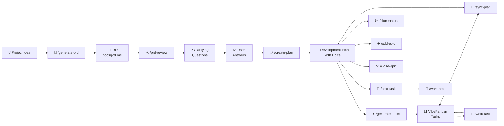
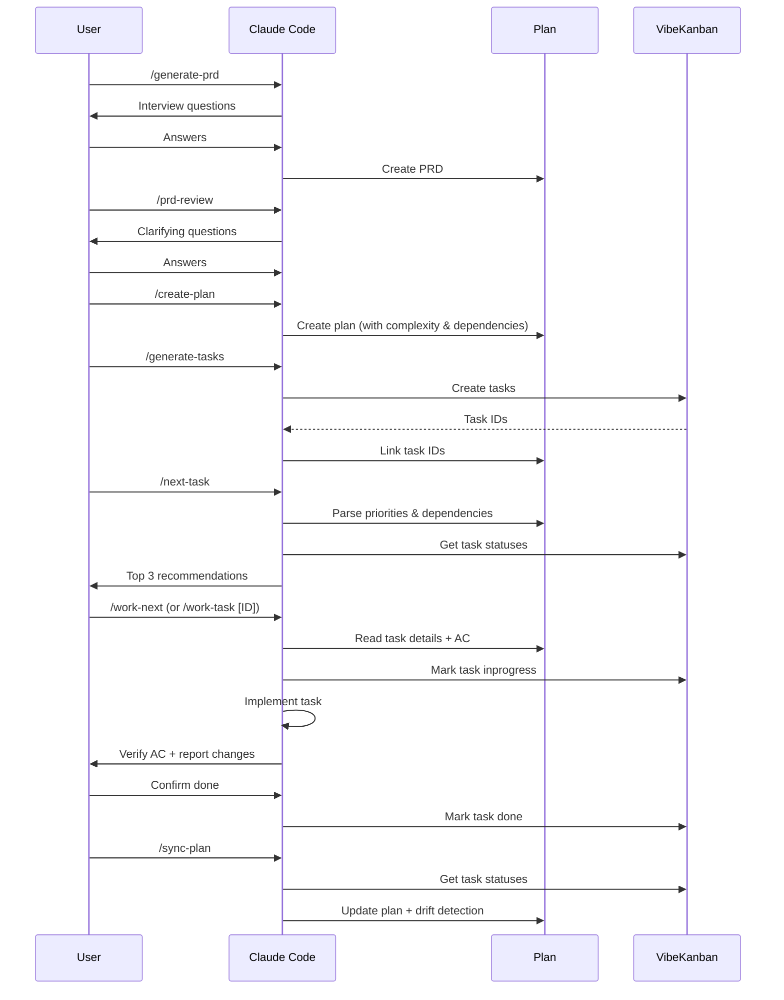
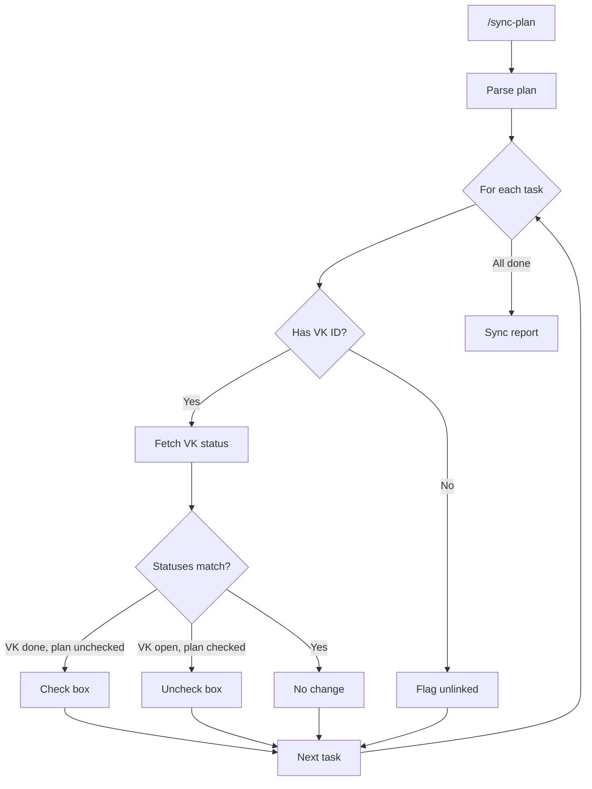

# PRD-to-Tasks Workflow for VibeKanban

A structured, prompt-driven workflow for going from project idea to tracked, executable tasks using [VibeKanban](https://www.vibekanban.com/) and AI coding agents. While this repo ships as Claude Code slash commands, the underlying workflow -- PRD generation, planning, task breakdown, execution, and sync -- works with any agent that connects to VibeKanban's MCP API.


## Why use this?

This is a **lightweight workflow, not a platform**. There's no app to install, no server to run, no database to manage -- just markdown-based slash commands that plug into Claude Code. The entire system is a process and methodology with minimal overhead.

Most AI coding tools help you **write code faster**. This helps you **decide what to build, break it down, and coordinate the work** -- then lets any AI agent do the coding.

- **Zero infrastructure** -- slash commands are markdown files you drop into Claude Code. No build step, no dependencies.
- **Structured planning** -- starts with PRD generation, epic decomposition, and dependency analysis, not a blank editor
- **Persistent tracking** -- task status lives in VibeKanban across sessions, not just within a single conversation
- **Safe parallelism** -- analyzes the dependency graph before spawning agents, so blocked tasks don't run
- **Local and remote execution** -- run agents locally via git worktrees (Tier 1) or delegate to remote VibeKanban workspace sessions (Tier 2)
- **Agent-agnostic** -- when using VibeKanban for delegation, any supported agent can pick up a task: Claude Code, Cursor, Codex, Gemini, Copilot, or custom agents. You're not locked to running Claude Code locally.
- **Adaptable** -- the workflow (PRD → plan → tasks → execute → sync) is the real value, not the specific integrations. The slash commands use VibeKanban today, but the patterns could be adapted to any external task management system (Linear, Jira, GitHub Issues) by swapping the MCP layer.

See [docs/comparisons.md](docs/comparisons.md) for detailed comparisons with AutoMaker, Claude Code Agent Teams, Cursor, Aider, and other tools.

## Design Philosophy

Automate the boring coordination and bookkeeping, keep humans in the loop for judgment calls. The planning pipeline needs your domain knowledge, drift detection flags problems but lets you decide what to do about them, and conflict resolution stops for human review rather than guessing. Fully autonomous merging and sync felt like a trap -- the 80% case is trivial, but for the 20% you really want a person paying attention.

## What is VibeKanban?

[VibeKanban](https://www.vibekanban.com/) is a Kanban-style project board designed for AI-assisted development. It provides an MCP (Model Context Protocol) server that lets AI agents create, update, and track tasks programmatically. Agents like Claude Code, Cursor, Codex, Gemini, and others can connect through the MCP API to:

- **Create and manage tasks** directly from the agent's context
- **Update task status** (todo, inprogress, inreview, done) as work progresses
- **Orchestrate multiple agents** on the same project board
- **Start workspace sessions** that pair an agent with a task and repo

VibeKanban acts as the shared coordination layer -- the agent does the coding, VK tracks what's been done and what's left.

## What This Repo Adds

This repo provides **17 slash commands** (12 core + 5 experimental) that build a complete development pipeline on top of VibeKanban's MCP API:

1. **PRD** (Product Requirements Document) defines what to build
2. **Development Plan** breaks it down into epics, tasks, dependencies, and acceptance criteria
3. **VibeKanban** tracks execution and progress across agents
4. **Execution** commands let agents pick up tasks, implement them, and verify acceptance criteria
5. **Sync** keeps the plan and board aligned with drift detection



## Commands

### Core Workflow

| Command | Description |
|---------|-------------|
| `/generate-prd` | Generate a PRD from a project idea through guided questions |
| `/prd-review` | Analyze PRD, identify gaps, suggest epic breakdown, ask clarifying questions |
| `/create-plan` | Generate a structured development plan with epics, complexity estimates, and dependencies |
| `/generate-tasks` | Create VibeKanban tasks from the development plan |
| `/sync-plan` | Synchronize plan with VibeKanban status with drift detection (VK is source of truth) |

### Execution

| Command | Description |
|---------|-------------|
| `/work-task` | Execute a specific task end-to-end with full context and AC verification |
| `/work-next` | Find the best next task and execute it (combines `/next-task` + `/work-task`) |

### Plan Management

| Command | Description |
|---------|-------------|
| `/plan-status` | Show progress summary without modifying files (read-only) |
| `/next-task` | Recommend the best next task based on priority, complexity, and dependencies |
| `/add-epic` | Add a new epic to an existing development plan |
| `/close-epic` | Mark an epic as complete after verifying all tasks are done |

### Parallel Execution (Experimental)

> **Early preview** -- these commands are experimental and actively evolving. Expect breaking changes over the next few weeks as the execution model is tested and refined. See [docs/architecture.md](docs/architecture.md) for the full design.

| Command | Description |
|---------|-------------|
| `/work-parallel` | Analyze backlog, identify independent tasks, set up worktrees, mark tasks in progress, and auto-launch parallel sessions (screen/tmux/background) |
| `/merge-parallel` | Merge worktree branches to main, run tests, update VK status, and clean up worktrees/sessions |
| `/delegate-task` | Delegate a task to a separate VibeKanban workspace session (any supported agent) |
| `/delegate-parallel` | Delegate multiple independent tasks to parallel workspace sessions |
| `/session-status` | Check status of all active workspace sessions |

Two execution tiers are supported:

- **Tier 1 (Local worktrees):** Parallel Claude Code sessions using [git worktrees](https://git-scm.com/docs/git-worktree) for full file isolation. Each task gets its own branch and working directory.
- **Tier 2 (Remote delegation):** Spawn separate agent sessions via VibeKanban's `start_workspace_session`. Supports Claude Code, Cursor, Codex, Gemini, Copilot, and custom agents.

See the [Parallel Task Execution Walkthrough](docs/parallel-task-execution-walkthrough.md) for a step-by-step example with screenshots showing the full Tier 1 workflow in action.

### Help

| Command | Description |
|---------|-------------|
| `/workflow` | Show command reference and recommended workflow order |

## Detailed Workflow



## Installation

### Quick Install

```bash
# Clone the repo
git clone https://github.com/ericblue/claude-vibekanban.git
cd claude-vibekanban

# Run the install script
./install.sh
```

### Manual Install

Copy the commands to your Claude Code global commands directory:

```bash
# Create the commands directory if it doesn't exist
mkdir -p ~/.claude/commands

# Copy commands
cp commands/*.md ~/.claude/commands/
```

### Verify Installation

After installing, the commands should be available in any Claude Code session:

```bash
claude
# Then type: /prd-review
```

## Updating Commands

If you make changes to commands in this repo and want to apply them:

```bash
# Option 1: Re-run install script (will prompt before overwriting)
./install.sh

# Option 2: Force overwrite without prompts
./install.sh --force

# Option 3: Copy specific command
cp commands/sync-plan.md ~/.claude/commands/

# Option 4: Symlink for live updates (development mode)
./install.sh --link
```

### Overwrite Behavior

When files already exist in `~/.claude/commands/`, the installer will prompt:

```
⚠ File already exists: sync-plan.md (file)
Overwrite? [y]es / [n]o / [a]ll / [s]kip all:
```

- **y** - Overwrite this file
- **n** - Skip this file
- **a** - Overwrite all remaining files without prompting
- **s** - Skip all remaining files without prompting

Use `--force` or `-f` to skip all prompts and overwrite everything.

## Prerequisites

### VibeKanban MCP Server

You need VibeKanban MCP configured. See: [VibeKanban MCP Documentation](https://www.vibekanban.com/docs/integrations/vibe-kanban-mcp-server)

Add to your Claude Code MCP configuration:

```json
{
  "mcpServers": {
    "vibekanban": {
      "command": "npx",
      "args": ["-y", "@anthropic/vibekanban-mcp"]
    }
  }
}
```

### Project Structure

Your projects should follow this structure:

```
your-project/
├── docs/
│   ├── prd.md                  # Your PRD (input)
│   └── development-plan.md     # Generated plan (output)
├── src/
└── ...
```

## Development Plan Format

The development plan uses an **epic-based format** that enables hierarchical task tracking with progress percentages, complexity estimates, and dependency management:

```markdown
# Development Plan: Project Name

> **Generated from:** docs/prd.md
> **Created:** 2024-01-22
> **Last synced:** 2024-01-22
> **Status:** Active Planning Document
> **VibeKanban Project ID:** abc-123-def

## Overview

Brief description of what we're building.

## Tech Stack

- **Backend:** Node.js, Express
- **Frontend:** React, TypeScript
- **Database:** PostgreSQL

---

## Completion Status Summary

| Epic | Status | Progress |
|------|--------|----------|
| 1. Foundation | Complete | 100% |
| 2. Core Features | In Progress | 50% |
| 3. Polish | Not Started | 0% |

---

## Epic 1: Foundation (COMPLETE)

Setting up the project infrastructure and dependencies.

### Acceptance Criteria

- [x] Project builds successfully
- [x] CI/CD pipeline runs on commits

### Tasks

| ID | Title | Description | Priority | Complexity | Depends On | Status |
|----|-------|-------------|----------|------------|------------|--------|
| 1.1 | Set up project structure | Initialize with folder structure | High | S | — | <!-- vk:abc123 --> |
| 1.2 | Configure CI/CD | GitHub Actions for testing | Medium | M | 1.1 | <!-- vk:def456 --> |

### Task Details

**1.1 - Set up project structure**
- [x] Project builds with no errors
- [x] Folder structure follows convention: src/, tests/, docs/
- [x] README includes setup instructions

**1.2 - Configure CI/CD**
- [x] GitHub Actions workflow runs on push to main
- [x] Tests execute and report results in CI
- [x] Build artifacts are generated

---

## Epic 2: Core Features (IN PROGRESS)

Implementing the main application functionality.

### Acceptance Criteria

- [ ] All API endpoints functional
- [ ] Unit test coverage > 80%

### Tasks

| ID | Title | Description | Priority | Complexity | Depends On | Status |
|----|-------|-------------|----------|------------|------------|--------|
| 2.1 | Implement auth | JWT-based authentication | High | L | 1.1, 1.2 | <!-- vk:ghi789 --> |
| 2.2 | Add user API | CRUD operations for users | High | M | 2.1 | <!-- vk:jkl012 --> |

### Task Details

**2.1 - Implement auth**
- [ ] POST /auth/login returns JWT for valid credentials
- [ ] POST /auth/register creates user and returns token
- [ ] Invalid credentials return 401
- [ ] Unit tests cover happy path and error cases

**2.2 - Add user API**
- [ ] GET /users/:id returns user profile
- [ ] PUT /users/:id updates user fields
- [ ] Endpoints require valid JWT
- [ ] Input validation rejects malformed data

---

## Changelog

- **2024-01-22**: Initial development plan created from PRD
- **2024-01-23**: Epic 1 marked complete; Epic 2 started
```

### Key Format Elements

| Element | Purpose |
|---------|---------|
| `## Epic N: Name (STATUS)` | Epic header with status (NOT STARTED / IN PROGRESS / COMPLETE) |
| `### Acceptance Criteria` | Checkable criteria for epic completion |
| Task table with ID | Hierarchical ID (Epic.Task, e.g., 1.1, 2.3) |
| `Priority` column | High / Medium / Low task priority |
| `Complexity` column | Size estimate: `S` (<1hr), `M` (1-4hrs), `L` (4-8hrs), `XL` (8hrs+) |
| `Depends On` column | Task IDs that must complete first, or `—` for none |
| `<!-- vk:ID -->` | VibeKanban task ID for syncing |
| `### Task Details` | Per-task acceptance criteria as checkboxes (2-4 testable conditions per task) |
| `## Completion Status Summary` | Dashboard table showing all epic progress |
| `## Changelog` | History of plan updates |

### Task Dependencies

Dependencies are tracked in the "Depends On" column using task IDs:
- `—` means the task has no dependencies and can be started immediately
- `1.1` means the task depends on task 1.1 being completed first
- `1.1, 1.2` means the task depends on both 1.1 and 1.2
- Dependencies can cross epic boundaries (e.g., task 2.1 depending on 1.2)

The `/next-task` command uses these dependencies to recommend which task to work on next, and `/sync-plan` detects dependency violations (tasks started before their dependencies are done).

## Sync Behavior



**Source of Truth:** VibeKanban status always wins during sync. This ensures the plan reflects actual work status.

## Customization

### Changing Plan Location

Edit `commands/create-plan.md` and `commands/sync-plan.md` to change from `docs/development-plan.md` to your preferred location.

### Adding Epics

The default epics in `/create-plan` are:
1. Foundation/Setup
2. Core Features
3. Supporting Features
4. Polish & UX
5. Testing & Documentation

Modify `commands/create-plan.md` to adjust these for your workflow. You can also use `/add-epic` to add new epics to an existing plan.

### Custom Task Fields

If VibeKanban supports additional fields (priority, labels, etc.), you can extend the `<!-- vk:ID -->` format:

```markdown
- [ ] **Task** <!-- vk:abc123 priority:high label:backend -->
```

And update the commands to parse/generate these.

## Troubleshooting

### Commands not appearing

1. Ensure commands are in `~/.claude/commands/`
2. Restart Claude Code session
3. Check file permissions: `ls -la ~/.claude/commands/`

### VibeKanban connection issues

1. Verify MCP server is configured: `/mcp` in Claude Code
2. Check VibeKanban authentication
3. Ensure project exists in VibeKanban

### Tasks not syncing

1. Verify task IDs in plan match VibeKanban: `<!-- vk:ACTUAL_ID -->`
2. Run `/generate-tasks` to link unlinked tasks
3. Check VibeKanban project has the tasks

## Contributing

1. Fork this repository
2. Make changes to commands in `commands/`
3. Test with `./install.sh`
4. Submit a pull request

## License

MIT License - See [LICENSE](LICENSE) for details.

## Supported Agents

While this repo ships as Claude Code slash commands, VibeKanban's MCP API supports orchestration with multiple agents:

| Agent | MCP Support | Notes |
|-------|-------------|-------|
| Claude Code | Native | This repo's slash commands |
| Cursor | Via MCP | Connect through Cursor's MCP settings |
| Codex | Via MCP | OpenAI's CLI agent |
| Gemini | Via MCP | Google's CLI agent |
| Copilot | Via MCP | GitHub's agent |
| Custom agents | Via MCP | Any agent supporting MCP tool calls |

The slash commands in this repo are markdown prompt files -- they can be adapted for other agents by translating the instructions into that agent's prompt format. The MCP tool calls (`list_projects`, `create_task`, `update_task`, etc.) are the same regardless of which agent makes them.

## Version History

| Version | Date | Changes |
|---------|------|---------|
| 0.1-alpha | 2025-12-27 | Alpha release with initial command structure and workflow design |
| 0.1 | 2026-01-22 | Initial release with 7 core commands: `/prd-review`, `/create-plan`, `/generate-tasks`, `/sync-plan`, `/plan-status`, `/add-epic`, `/close-epic` |
| 0.2 | 2026-02-06 | Added `/generate-prd` (interview-style PRD creation) and `/next-task` (priority-based task recommendation). Enhanced `/create-plan` with Complexity and Depends On columns, per-task acceptance criteria in Task Details sections. Enhanced `/sync-plan` with drift detection (stale tasks, dependency violations, blocked tasks ready to start, scope drift). Fixed MCP tool name prefix (`mcp__vibe_kanban__`) across all commands. Replaced inline bash execution with tool instructions to fix permission errors. |
| 0.21 | 2026-02-06 | Added `/work-task` and `/work-next` execution commands for autonomous task implementation with full context assembly and AC verification. Expanded README with VibeKanban overview, multi-agent support table, and board screenshot. |
| 0.3.1-preview | 2026-02-07 | Experimental parallel execution: `/work-parallel` (local worktrees + full CC sessions with screen/tmux auto-launch, failure recovery, `SESSION_STATUS:` log markers), `/merge-parallel` (sequential merging, optional test commands, VK status updates, worktree/session cleanup), `/delegate-task`, `/delegate-parallel`, `/session-status` (cross-references session state + VK status + log markers). Two-tier execution model. Completion logs appended to VK task descriptions as stopgap for missing comment API. Renamed `/delegate-batch` to `/delegate-parallel`. Added [architecture doc](docs/architecture.md) and [cookbook](docs/cookbook.md) with recipes for parallel work, quality gates, and result logging. |

## Documentation

- **[Cookbook](docs/cookbook.md)** -- Walkthroughs, recipes, tips, FAQ, and troubleshooting
- **[Parallel Task Execution Walkthrough](docs/parallel-task-execution-walkthrough.md)** -- Step-by-step example of running 3 tasks in parallel with screenshots
- **[Architecture](docs/architecture.md)** -- Execution model, two-tier parallel execution design, known limitations, and future direction for multi-agent orchestration

## Related

- [VibeKanban](https://www.vibekanban.com/) - Kanban board with AI agent orchestration
- [VibeKanban MCP Docs](https://www.vibekanban.com/docs/integrations/vibe-kanban-mcp-server) - MCP server setup and API reference
- [Claude Code](https://claude.ai/claude-code) - Anthropic's CLI for Claude
- [MCP (Model Context Protocol)](https://modelcontextprotocol.io/) - Protocol for AI tool integration

## About

A structured, prompt-driven development workflow that bridges product requirements and AI-powered task execution through VibeKanban's MCP API. Designed to give AI coding agents the full context they need -- from PRD to acceptance criteria -- to autonomously implement, verify, and track development tasks.

Created by [Eric Blue](https://about.ericblue.com)